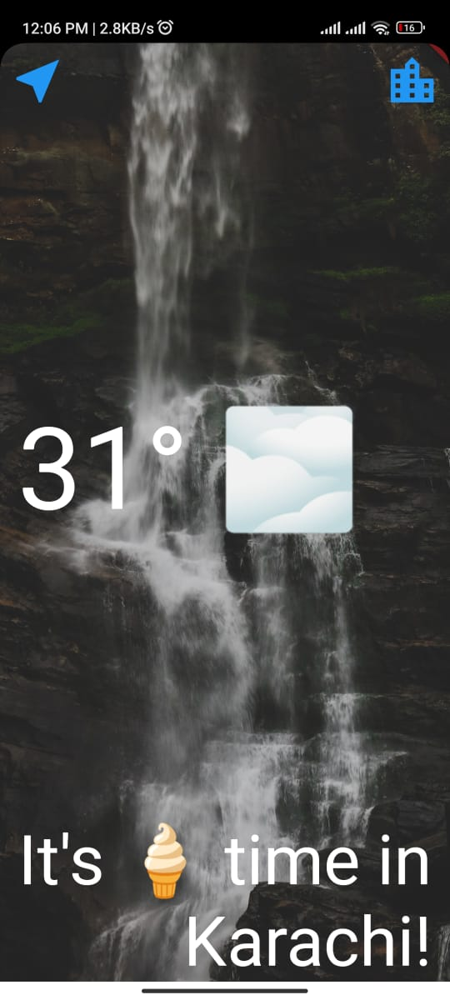
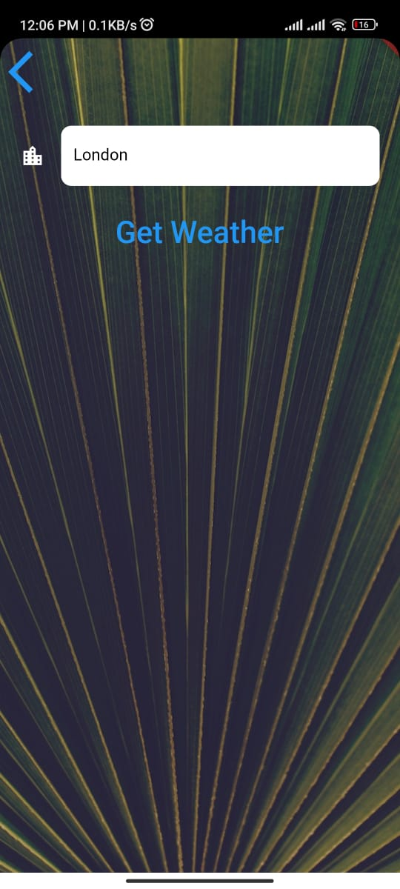

# Clima

A simple flutter application to see the weather of any city in the world.

## Technology Stack
- Flutter
- Dart
- OpenWeatherMap API
- Geolocator
- HTTP
- JSON
- Material Design
- Android Studio

## Features
- Get the weather of your current location
- Search for a city by name to get its weather

## Working
- The app uses the Geolocator package to get the current location of the user.
- It uses the OpenWeatherMap API to get the weather of the current location or the location searched by the user.
- The HTTP package is used to make requests to the OpenWeatherMap API.
- Material Design package is used to create a beautiful UI.

## Screenshots

